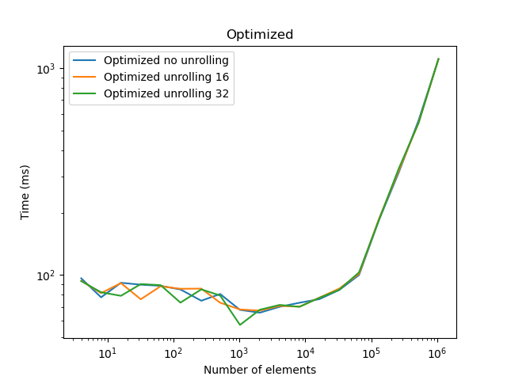

# Discussion

Group gpu03:
- Fyock, Colin
- Hlavaty, Moritz Jan
- Hui, Ka Wong
- Mironovich, Elizaveta
- Sizovs, Andrejs
- Vandermoeten, Frederick David

Completed tasks: 7.1, 7.2

Willingness to present: yes to 7.1, 7.2

## 7.1 Naive implementation

The performance of the naive implementation is at first stable at around 5ms for very small (<10) particles. However, later on, the performance is roughly linear with the number of particles. For 2^18 particles, the n-Body Computation takes around 4 minutes. This means roughly 2.4 seconds per timestep.

## 7.2 Optimized implementation

We used a AOS (Array of Structures) layout for the particles. We also used tiling to make computations and memory accesses more regular. This greatly improved the performance by several orders of magnitude. The 2^19 particles simulation now takes around 1 second in total.
Also, until 2^16 the time is roughly constant with 0.1 s in total. This shows until when the cache is big enough to hold all the particles.

We also tried to unroll the inner loop, but this did not improve the performance in a significant way.